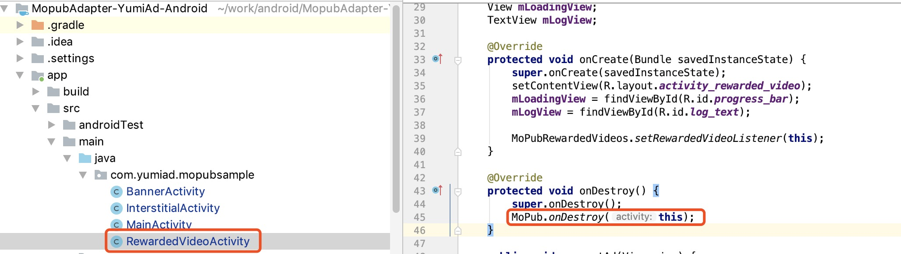

 * [How to integrate YumiAdSDK to Mopub Mediation SDK](#how-to-integrate-yumiadsdk-to-mopub-mediation-sdk)
      * [1. Mopub Mediation SDK  Integrated YumiAdSDK adapter](#1-mopub-mediation-sdk--integrated-yumiadsdk-adapter)
         * [1.1 Add YumiAdSDK Mopub Adapter to your project](#11-add-yumiadsdk-mopub-adapter-to-your-project)
         * [1.2 add build.gradle dependencies](#12-add-buildgradle-dependencies)
      * [2. Add new custom sdk network in Mopub dashboard](#2-add-new-custom-sdk-network-in-mopub-dashboard)
         * [2.1 Click new network button](#21-click-new-network-button)
         * [2.2 Choose custom sdk network](#22-choose-custom-sdk-network)
         * [2.3 Enter the network name，like YumiAdSDK](#23-enter-the-network-namelike-yumiadsdk)
         * [2.4 Enter Custom event class and Custom event class data](#24-enter-custom-event-class-and-custom-event-class-data)
         * [2.5 Make sure the network status is running.](#25-make-sure-the-network-status-is-running)
         * [2.6 Choose the Segments -&gt; Global Segment](#26-choose-the-segments---global-segment)
         * [2.7 Make sure the source status is running.](#27-make-sure-the-source-status-is-running)
         * [2.8 Final check list](#28-final-check-list)
      * [3. Note](#3-note)
         * [3.1 Permissions for Android 6.0 and newer versions（Optional）](#31-permissions-for-android-60-and-newer-versionsoptional)
         * [3.2 If you loaded YumiAdSDK  rewarded video ads, please call the MoPub.onDestroy(this) interface in your Activity's onDestroy method.](#32-if-you-loaded-yumiadsdk--rewarded-video-ads-please-call-the-mopubondestroythis-interface-in-your-activitys-ondestroy-method)
      * [4.Test SLOTID](#4test-slotid)


# How to integrate YumiAdSDK to Mopub Mediation SDK


## 1. Mopub Mediation SDK  Integrated YumiAdSDK adapter

### 1.1 Add YumiAdSDK Mopub Adapter to your project
[Download YumiAdSDK  Mopub Adapter](https://github.com/yumimobi/MopubAdapter-YumiAd-Android/tree/master/mopubadapter/src/main/java/com/yumiad/mopubadapter)


### 1.2 add build.gradle dependencies

```java
//add YumiAdSDK maven url to project's build.gradle
buildscript {
    repositories {
   	 jcenter()
    }
}
allprojets {
    repositories {
        jcenter()
		//mopub sdk maven
        maven { url "https://s3.amazonaws.com/moat-sdk-builds" }
    }
}

//add YumiAdSDK and mopub dependencies.
dependencies {
	//YumiAdSDK
    implementation 'com.yumimobi.ads:yumiad:4.5.0.000'
	// mopub sdk
    implementation('com.mopub:mopub-sdk:5.4.0') {
        transitive = true
    }
}
```

## 2. Add new custom sdk network in Mopub dashboard
### 2.1 Click new network button

### 2.2 Choose custom sdk network 

### 2.3 Enter the network name，like YumiAdSDK

### 2.4 Enter Custom event class and Custom event class data
- for Banner:
	- custom event class should be `com.yumiad.mopubadapter.YumiAdBanner`
	- custom event class data should be
		`{ "slotId":"YOUR_SLOTID"}`

- for Interstitial:
	- custom event class should be `com.yumiad.mopubadapter.YumiAdInterstitial`
	- custom event class data should be
		`{ "slotId":"YOUR_SLOTID"}`

- for RewardedVideo:
	- custom event class should be `com.yumiad.mopubadapter.YumiAdRewardedVideo`
	- custom event class data should be
		`{ "slotId":"YOUR_SLOTID"}`


### 2.5 Make sure the network status is running.

### 2.6 Choose the Segments -> Global Segment

### 2.7 Make sure the source status is running.

### 2.8 Final check list
Apps->Your_App->Your_Ad_Unit_Name-> Ad source 
	make sure the ad source status is running.


## 3. Note

### 3.1 Permissions for Android 6.0 and newer versions（Optional）

	When the targetSdkVersion of your app is 23 or above, you can choose the following method to check permission and prompt for user authorization

	Please at Mopub custom event class data add runInCheckPermissions：
	
`{ "slotId":"YOUR_SLOTID", "runInCheckPermissions": true}`
	
<div style="background-color:rgb(228,244,253);padding:10px;">
	<span style="color:rgb(62,113,167);">
	<b>Note: </b>The default setting for this runInCheckPermissions is false, it won’t prompt for user authorisation or causing crash. If set as true, it will check permission and prompt for user authorisation with popups.
	</span>
	</div>

<div style="background-color:rgb(228,244,253);padding:10px;">
	<span style="color:rgb(255,0,0);">
	<b>Important Note: </b>Please ensure can get READ_PHONE_STATE, WRITE_EXTERNAL_STORAGE, ACCESS_COARSE_LOCATION, ACCESS_FINE_LOCATION permissions, if not get these permissions, it will affect the revenue of the ads.
	</span>
	</div>

### 3.2 If you loaded YumiAdSDK  rewarded video ads, please call the MoPub.onDestroy(this) interface in your Activity's onDestroy method.
    

<div style="background-color:rgb(228,244,253);padding:10px;">
	<span style="color:rgb(62,113,167);">
	<b>Note：</b>YumiAdSDK will clean up the video data after calling the MoPub.onDestroy(this) interface.
	</span>
	</div>

## 4.Test SLOTID 

| OS | Slot Format | Slot ID |
| ----- | ----- | ----- |
| Android |  banner | uz852t89 |
| Android |  Interstitial | 56ubk22h |
| Android | Reawrd Video | ew9hyvl4 |
