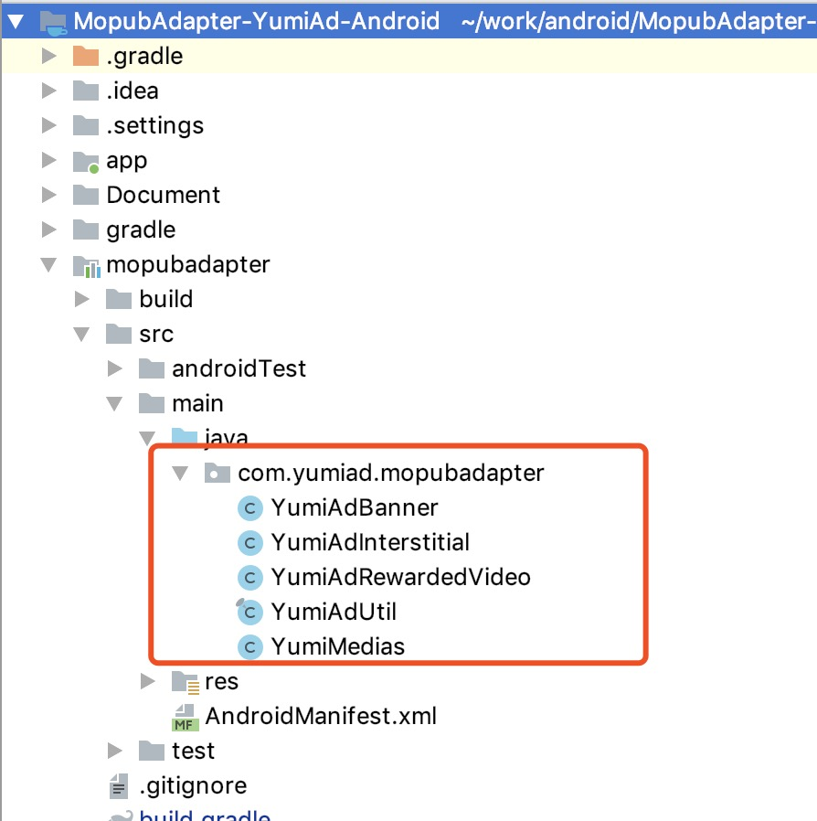

   * [Mopub Mediation SDK 接入 YumiAdSDK](#mopub-mediation-sdk-接入-yumiadsdk)
      * [1. YumiAdSDK Mopub Adapter接入步骤](#1-yumiadsdk-mopub-adapter接入步骤)
         * [1.1 添加YumiAdSDK Mopub Adapter源码到你的工程中](#11-添加yumiadsdk-mopub-adapter源码到你的工程中)
         * [1.2 添加build.gradle依赖](#12-添加buildgradle依赖)
      * [2.在 Mopub dashboardnew 中添加 custom sdk network](#2在-mopub-dashboardnew-中添加-custom-sdk-network)
         * [2.1 点击 new network button](#21-点击-new-network-button)
         * [2.2 选择 custom sdk network](#22-选择-custom-sdk-network)
         * [2.3 填写 network name，例如 YumiAdSDK](#23-填写-network-name例如-yumiadsdk)
         * [2.4 填写 Custom event class 以及 Custom event class data](#24-填写-custom-event-class-以及-custom-event-class-data)
         * [2.5 确保 network status is running.](#25-确保-network-status-is-running)
         * [2.6 选择 Segments -&gt; Global Segment](#26-选择-segments---global-segment)
         * [2.7 确保 source status is running.](#27-确保-source-status-is-running)
         * [2.8 最终检查](#28-最终检查)
      * [3. 注意事项](#3-注意事项)
         * [3.1 Android6.0以上系统权限处理（可选）](#31-android60以上系统权限处理可选)
         * [3.2 如果接入YumiAdSDK激励视频广告,请在Activity的onDestroy方法中调用MoPub.onDestroy(this)接口](#32-如果接入yumiadsdk激励视频广告请在activity的ondestroy方法中调用mopubondestroythis接口)
         * [3.3 targetSdkVersion &gt;= 24 适配](#33-targetsdkversion--24-适配)
      * [4.Test SLOTID](#4test-slotid)
	  
# Mopub Mediation SDK 接入 YumiAdSDK 


## 1. YumiAdSDK Mopub Adapter接入步骤

### 1.1 添加YumiAdSDK Mopub Adapter源码到你的工程中
[下载 YumiAdSDK  Mopub Adapter ](https://github.com/yumimobi/MopubAdapter-YumiAd-Android/tree/master/mopubadapter/src/main/java/com/yumiad/mopubadapter)



### 1.2 添加build.gradle依赖

```java
//确认 android studio 的 Project 根目录主 build.gradle 中配置了 jcenter 支持。
buildscript {
    repositories {
   	 jcenter()
    }
}
allprojets {
    repositories {
        jcenter()
        //mopub sdk maven
        maven { url "https://s3.amazonaws.com/moat-sdk-builds" }
    }
}

//在 module 的 build.gradle 中添加依赖
dependencies {
	//YumiAdSDK
    implementation 'com.yumimobi.ads:yumiad:1.1.0'
	// mopub sdk
    implementation('com.mopub:mopub-sdk:+@aar') {
        transitive = true
    }
}
```

## 2.在 Mopub dashboardnew 中添加 custom sdk network 
### 2.1 点击 new network button

### 2.2 选择 custom sdk network 

### 2.3 填写 network name，例如 YumiAdSDK

### 2.4 填写 Custom event class 以及 Custom event class data
- Banner:
	- custom event class 应该为 `com.yumiad.mopubadapter.YumiAdBanner`
	- custom event class data 应该为
		`{ "slotId":"YOUR_SLOTID"}`

- Interstitial:
	- custom event class 应该为 `com.yumiad.mopubadapter.YumiAdInterstitial`
	- custom event class data 应该为
		`{ "slotId":"YOUR_SLOTID"}`

- RewardedVideo:
	- custom event class 应该为 `com.yumiad.mopubadapter.YumiAdRewardedVideo`
	- custom event class data 应该为
		`{ "slotId":"YOUR_SLOTID"}`


### 2.5 确保 network status is running.

### 2.6 选择 Segments -> Global Segment

### 2.7 确保 source status is running.

### 2.8 最终检查
Apps->Your_App->Your_Ad_Unit_Name-> Ad source 
	确保 ad source status is running.


## 3. 注意事项

### 3.1 Android6.0以上系统权限处理（可选）

	当您的应用targetSdkVersion为23及以上时，可选择以下方法进行权限检查并且弹窗提示用户授权。

	在Mopub后台配置custom event class data时请添加runInCheckPermissions配置：
	
`{ "slotId":"YOUR_SLOTID", "runInCheckPermissions": true}`
	
<div style="background-color:rgb(228,244,253);padding:10px;">
	<span style="color:rgb(62,113,167);">
	<b>提示：</b>该配置默认为false， 不会对用户进行权限提示并且不会导致崩溃。设为true，会进行权限检查并且弹窗提示用户授权。
	</span>
	</div>

<div style="background-color:rgb(228,244,253);padding:10px;">
	<span style="color:rgb(255,0,0);">
	<b>重要提示：</b>请确保可以获取到READ_PHONE_STATE,WRITE_EXTERNAL_STORAGE,ACCESS_COARSE_LOCATION,ACCESS_FINE_LOCATION权限，如果获取不到这些权限，会影响广告的收益。
	</span>
	</div>

### 3.2 如果接入YumiAdSDK激励视频广告,请在Activity的onDestroy方法中调用MoPub.onDestroy(this)接口
    

<div style="background-color:rgb(228,244,253);padding:10px;">
	<span style="color:rgb(62,113,167);">
	<b>提示：</b>调用MoPub.onDestroy(this)接口后YumiAdSDK会清理视频数据
	</span>
	</div>

### 3.3 targetSdkVersion >= 24 适配
 如果您打包 App 时的 targetSdkVersion >= 24，为了让 SDK 能够正常下载、安装 App 类广告，必须按照下面的步骤做兼容性处理
 
 **步骤一：在 AndroidManifest.xml 中的 Application 标签中添加 provider 标签**
  ```java
     <provider
        android:name="android.support.v4.content.FileProvider"
        android:authorities="${applicationId}.fileprovider"
        android:exported="false"
        android:grantUriPermissions="true">
        <meta-data
            android:name="android.support.FILE_PROVIDER_PATHS"
            android:resource="@xml/gdt_file_path" />
     </provider>

     <provider
        android:name="com.baidu.mobads.openad.FileProvider"
        android:authorities="${applicationId}.bd.provider"
        android:exported="false"
        android:grantUriPermissions="true">
        <meta-data
            android:name="android.support.FILE_PROVIDER_PATHS"
            android:resource="@xml/bd_file_paths" />
     </provider>
  ```
<div style="background-color:rgb(228,244,253);padding:10px;">
<span style="color:rgb(62,113,167);">
<b>提示：</b>如果你的工程不支持 ${applicationId} 配置，可以将 ${applicationId} 替换为你的App包名
</span>
</div>

**步骤二：在项目结构下的 res 目录下添加一个 xml 文件夹，下载bd_file_paths.xml和gdt_file_path.xml文件，将下载下来的xml文件添加到创建的 xml 文件夹中：**

Download [bd_file_paths.xml](https://github.com/yumimobi/MopubAdapter-YumiAd-Android/tree/master/app/src/main/res/xml/bd_file_paths.xml)

Download [gdt_file_path.xml](https://github.com/yumimobi/MopubAdapter-YumiAd-Android/tree/master/app/src/main/res/xml/gdt_file_path.xml)

<div style="background-color:rgb(228,244,253);padding:10px;">
<span style="color:rgb(250,0,0);">
<b>注意：</b> 如果不进行上面的配置，会影响广告收入
</span>
</div>

## 4.Test SLOTID 

| OS | Slot Format | Slot ID |
| ----- | ----- | ----- |
| Android |  banner | uz852t89 |
| Android |  Interstitial | 56ubk22h |
| Android | Reawrd Video | ew9hyvl4 |
